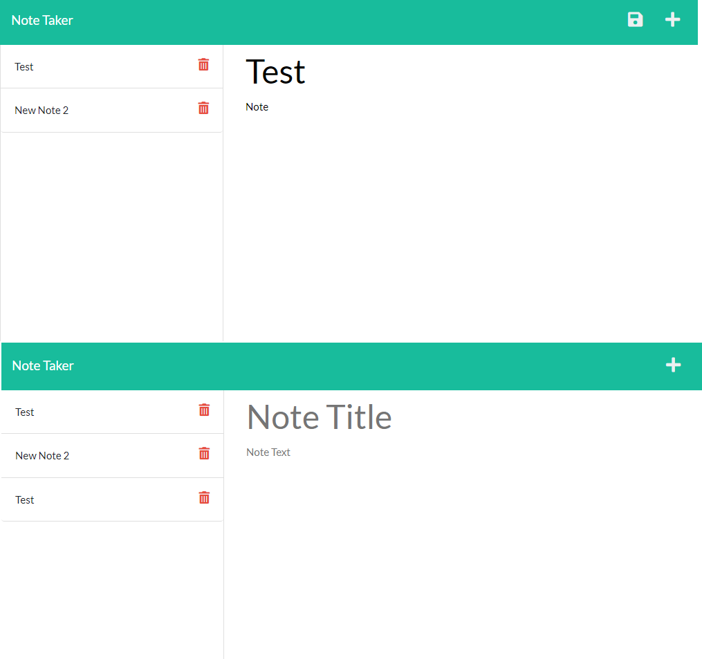

# Note Taker

## Table of Contents

[Description](#description)

[Installation Instructions](#installation)

[Usage Instructions](#usage)

[License](#license)

[Github](#github)

## Description

An application that allows a user to save, delete and store notes online.

accessible through Github and Heroku

https://github.com/patrickthegu/c11-note-taker

https://tranquil-mesa-79620.herokuapp.com/

## Installation Instructions

Download from Github and navigate to directory
run npm i to install dependencies
run npm start

alternately access from Heroku Link

## Usage Instructions

From the home page click Get Started to direct to the notes page

To access a saved note, click on the note in the left column

To create a new note, click the plus button, enter Note title and text then click save

To delete a note, click the trash icon next to the saved note

## License

[Apache License 2.0](https://opensource.org/licenses/Apache-2.0)

## Github

[patrickthegu](https://github.com/patrickthegu)

